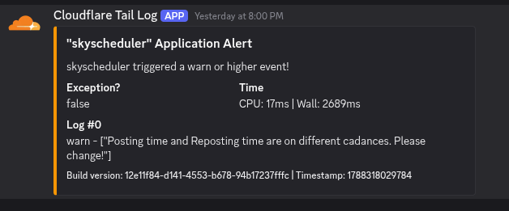

# TailLogger



A tail logging system for reporting CF worker statuses to Discord.

## To Deploy

1. Clone project, run `npm ci`
2. Copy `.env.example` to `.env`
3. Add your Discord webhook URL to the `.env` file
4. Run `npx wrangler deploy --secrets-file=.env`
5. Add tail logger to producer `wrangler.toml` files like below


---

Add to projects by adding the following to your producer worker:

```toml
[[tail_consumers]]
service = "taillog"
remote = false
```

---

### Log Levels

Set your worker names in the attached KV. Valid values are:

- exception
- error
- warn
- log
- info
- debug
- all